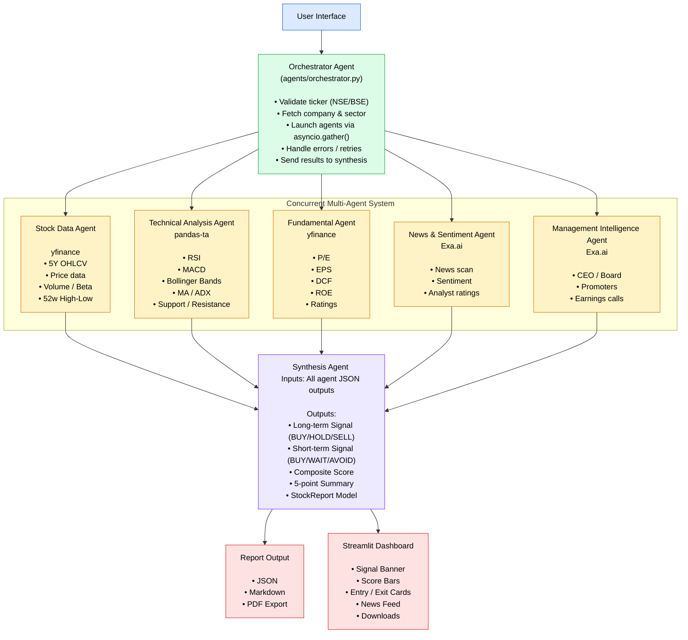

**Legal Disclaimer:**

> **This tool is for educational and non-commercial usage. This tool is only supposed to provide a detailed report and recommendations about a stock, use your common sense before investing blindly. Adding a wallet or giving direct monetary access and decision making is not recommended and will require custom changes, you are free to build on top of this for personal usage.**

# Multi-Agent Stock Analysis System

This is a multi-agent system built specifically for retail investors using platforms like **Groww**, **Zerodha**, or **Angel One** in the Indian market. Instead of relying on manual research or screenshot-based advice, this system runs specialized AI agents in parallel (plus a dedicated red-team pass), each analysing a different dimension of a stock, and synthesises everything into a single clean investment report.

The system answers three core questions every investor needs:

| Question | Where to look |
|---|---|
| **Should I buy this stock?** | Overall Signal + Composite Score |
| **At what price do I enter?** | Entry Price / Entry Condition |
| **When do I exit?** | Targets + Stop Loss + Exit Triggers |

---

## Architecture


---

##  Key Features

-  **Specialized AI Agents + Red Team Pass** orchestrated via `asyncio`
-  **Full Technical Analysis** — RSI, MACD, Bollinger Bands, Moving Averages, ADX, ATR, Stochastic
-  **Fundamental Analysis** — P/E, EPS growth, ROE, DCF intrinsic value, sector comparison
-  **Live News & Sentiment** — powered by Exa.ai searching 30+ news sources in real time
-  **Management Intelligence** — CEO changes, promoter activity, earnings call analysis, red flag detection
-  **Exact Entry/Exit Levels** — not vague ranges, but specific ₹ price levels with conditions
-  **Dual Horizon Signals** — separate Long-Term (1–3 year) and Short-Term (1–8 week) recommendations
-  **Composite Scoring** — 5-dimension score (Technical / Fundamental / Sentiment / Management / Valuation)
-  **Streamlit Dashboard** — clean UI with signal banners, score bars, and one-click report export
-  **Report Export** — save as Markdown, JSON, or PDF

---

## Agent Descriptions

### 1. Stock Data Agent — `agents/stock_data_agent.py`

The foundation agent. Pulls all raw price and market data from Yahoo Finance.

**What it fetches:**
- 5 years of daily OHLCV (Open/High/Low/Close/Volume) data
- 3 months of hourly data for short-term analysis
- Current price, 52-week high/low, market cap, beta, average volume
- Performance across 1W / 1M / 3M / 6M / 1Y / 3Y periods
- Proximity to 52-week high or low (within 5% = flagged)

**Output:** Structured dict with raw DataFrames for other agents to consume

---

### 2. Technical Analysis Agent — `agents/technical_agent.py`

Runs all technical indicators and generates exact entry/exit price levels.

**Indicators computed:**

| Indicator | Usage |
|---|---|
| RSI (14) | Overbought >70, Oversold <30 |
| MACD (12,26,9) | Trend direction and crossover signals |
| Bollinger Bands (20,2) | Volatility and breakout detection |
| SMA 20 / 50 / 200 | Trend structure and support/resistance |
| EMA 9 / 21 | Short-term momentum |
| ATR (14) | Stop-loss calculation (1.5x ATR) |
| ADX (14) | Trend strength (>25 = strong trend) |
| Stochastic (14,3) | Momentum and reversal signals |
| VWAP | Intraday fair value reference |

**Pattern Detection:**
- Golden Cross / Death Cross
- RSI Divergence (hidden bullish/bearish)
- MACD Bullish/Bearish Crossover
- Bollinger Band Squeeze

**Price Level Calculation:**
- Entry Price (support-based or breakout-based)
- Stop Loss = Entry − (1.5 × ATR)
- Target 1, 2, 3 (resistance levels)

---

### 3. Fundamental Analysis Agent — `agents/fundamental_agent.py`

Evaluates financial health, valuation, and intrinsic value.

**Metrics extracted:**

| Category | Metrics |
|---|---|
| Valuation | P/E, P/B, EV/EBITDA |
| Profitability | Net Margin, ROE, ROA |
| Growth | Revenue Growth YoY, EPS Growth YoY |
| Financial Health | Debt/Equity, Current Ratio, Free Cash Flow |
| Income | Dividend Yield, EPS (trailing 4 quarters) |

**Sector Comparison:** Compares P/E to sector average across 15 Indian sectors (IT, Banking, FMCG, Auto, Pharma, Energy, etc.) to label the stock as UNDERVALUED / FAIRLY VALUED / OVERVALUED.

**DCF Intrinsic Value:** Uses dynamic WACC (beta + leverage aware), sector-aware terminal growth, and bear/base/bull scenarios. Displays upside/downside % from current price for each case.

---

### 4. News & Sentiment Agent — `agents/sentiment_agent.py`

Scans the internet in real time using Exa.ai across 5 targeted search queries.

**Searches run:**
1. Recent stock news (last 30 days)
2. Quarterly earnings and results
3. Analyst ratings and price targets
4. Regulatory / government / SEBI / RBI news
5. Sector-wide outlook and competitor news

**Sentiment Scoring:**
- Each article classified: POSITIVE / NEGATIVE / NEUTRAL
- Impact-weighted: HIGH (3x) · MEDIUM (2x) · LOW (1x)
- Source-credibility weighted (Tier-1 > Tier-2 > unknown)
- Recency-decayed (fresh news weighs more than stale articles)
- Final output: VERY POSITIVE / POSITIVE / NEUTRAL / NEGATIVE / VERY NEGATIVE

**Analyst Consensus:** Counts Buy / Hold / Sell ratings found in reports, extracts average / high / low target prices.

---

### 5. Management Intelligence Agent — `agents/management_agent.py`

Analyses leadership quality, insider activity, and strategic direction via Exa.ai.

**Searches run:**
1. CEO/MD/leadership strategy and commentary
2. Insider trading and promoter stake changes
3. Earnings call transcripts and management guidance
4. Corporate governance and SEBI compliance
5. Expansion plans, capex, and M&A activity

**Red Flag Detection (automatic):**
- CEO / CFO resignation
- Auditor change or resignation
- Pledged promoter shares rising
- Regulatory probe or legal cases
- Promoter holding declining over multiple quarters

**Promoter Holding Trend:** INCREASING (bullish) / STABLE / DECREASING (bearish warning)

---

### 6. Synthesis Agent — `agents/synthesis_agent.py`

The core reasoning agent. It now runs a multi-pass chain:
1) critique each agent output,
2) resolve contradictions and risk hierarchy,
3) generate the final structured investment report.

**Generates:**
- Long-Term Signal (1–3 years): BUY / ACCUMULATE / HOLD / REDUCE / SELL
- Short-Term Signal (1–8 weeks): BUY / WAIT / AVOID / SELL
- Exact ₹ entry price, stop loss, and targets for both horizons
- Risk/Reward ratio
- Composite score (5 dimensions, each out of 10) using dynamic market-cap/liquidity-aware weights
- 5-point key summary (TL;DR)
- Confidence % based on agent agreement

### 7. Red Team Agent — `agents/red_team_agent.py`

Runs a downside-first challenge pass across technical, fundamental, sentiment, and management outputs.

**Produces:**
- contradiction map between agent conclusions
- top failure scenarios
- thesis-killer triggers that can invalidate the bull case
- dominant risk ordering for synthesis

---

## Tech Stack

| Layer | Technology | Purpose |
|---|---|---|
| Language | Python 3.11+ | Core runtime |
| Agent Framework | CrewAI | Multi-agent orchestration |
| LLM | Use any API key (claude, OpenAI) | Reasoning and synthesis |
| Web Intelligence | Exa.ai Python SDK | Live news, sentiment, management data |
| Market Data | yfinance | NSE/BSE price and fundamental data |
| Technical Analysis | pandas-ta | 40+ technical indicators |
| Data Processing | pandas, numpy | DataFrames and numerical computation |
| Frontend | Streamlit | Interactive web dashboard |
| Data Validation | Pydantic v2 | Typed report schema |
| Async Execution | asyncio | Parallel agent execution |
| Secrets | python-dotenv | API key management |
| HTTP | httpx | Async HTTP calls |
| Visualization | plotly | Score charts, price charts |

---

## Configuration

All system-level constants live in `config/settings.py`. Key settings you may want to adjust:

```python
# Sector P/E averages used for valuation comparison
SECTOR_PE_AVERAGES = {
    "Technology": 25,
    "Banking": 15,
    "FMCG": 45,
    "Automobile": 20,
    "Pharmaceuticals": 30,
    "Energy": 12,
    "Infrastructure": 18,
    "Metals": 10,
    "Telecom": 22,
    "Real Estate": 35,
    "Insurance": 28,
    "NBFCs": 20,
    "Chemicals": 32,
    "Cement": 25,
    "Consumer Durables": 38,
}

# Lookback periods
DEFAULT_LOOKBACK_DAYS = 365 * 5        # 5 years for long-term analysis
SHORT_TERM_LOOKBACK_DAYS = 90          # 3 months for short-term

# Technical settings
STOP_LOSS_ATR_MULTIPLIER = 1.5         # Stop = Entry - (1.5 × ATR)
NEAR_52W_THRESHOLD = 0.05              # Flag if within 5% of 52-week high/low

# DCF Valuation inputs
DCF_DISCOUNT_RATE = 0.12               # 12% discount rate (WACC estimate)
DCF_TERMINAL_GROWTH = 0.04            # 4% long-term terminal growth

# Agent execution
AGENT_TIMEOUT_SECONDS = 60            # Max time per agent
EXA_SEARCH_DELAY_SECONDS = 0.5        # Rate limit delay between Exa searches
```

---

##  How Signals Are Generated

The final signal is derived from a weighted combination of all 5 agents.
Weights are dynamic by market cap and liquidity profile (large-cap vs mid-cap vs small/illiquid):

```
Overall Score = (Technical × w1) + (Fundamental × w2)
              + (Sentiment × w3) + (Management × w4)
              + (Valuation × w5)

Signal mapping:
  8.0 – 10.0  →  STRONG BUY
  6.5 –  7.9  →  BUY
  5.5 –  6.4  →  ACCUMULATE / HOLD
  4.0 –  5.4  →  WAIT / REDUCE
  0.0 –  3.9  →  SELL / AVOID
```

**Confidence %** is calculated based on how many agents agree:

| Agreement | Confidence |
|---|---|
| 5/5 agents bullish | 90–95% |
| 4/5 agents bullish | 70–80% |
| 3/5 agents bullish | 50–65% |
| Mixed signals | 30–50% |

---

## Data Sources

| Data Type | Source | Freshness |
|---|---|---|
| Stock price & OHLCV | Yahoo Finance (yfinance) | Real-time / 15-min delay |
| Company fundamentals | Yahoo Finance | Quarterly updates |
| Technical indicators | pandas-ta (computed locally) | Based on price data |
| News & recent events | Exa.ai web search | Live (crawled in real-time) |
| Analyst ratings | Exa.ai (brokerage reports) | Live |
| Management activity | Exa.ai (BSE filings, news) | Live |
| Earnings call content | Exa.ai | Live |
| Insider trades | Exa.ai (SEBI disclosures) | Live |

---

## API Usage & Cost Estimates

| Operation | API | Calls Per Analysis | Estimated Cost |
|---|---|---|---|
| Stock data + fundamentals | yfinance | 8–10 calls | Free |
| Technical indicators | pandas-ta | 0 (local) | Free |
| News sentiment | Exa.ai | 5 searches (~50 results) | ~$0.05–0.10 |
| Management intelligence | Exa.ai | 5 searches (~40 results) | ~$0.05–0.10 |
| Report synthesis | Anthropic Claude | 3 chained calls (critique → conflict map → final report) | ~$0.05–0.12 |
| **Total per analysis** | | | **~$0.12–0.25** |

---

## Limitations & Disclaimer

**Technical Limitations:**
- yfinance may have occasional data gaps for smaller NSE stocks
- Exa.ai results depend on what is publicly indexed; some niche news may be missed
- DCF valuation is an approximation — treat as one signal, not ground truth
- Technical signals work best on liquid large-cap stocks (Nifty 50 / Nifty 200)
- Short-term signals are less reliable during high-volatility events (budget, elections, global crises)
